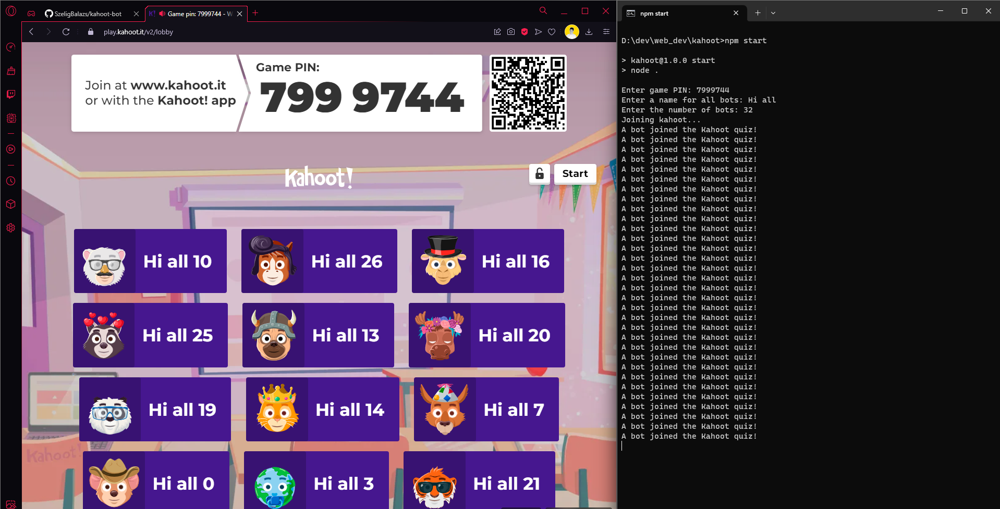

<div align="center">
    <h1>Working Kahoot Spammer with JS</h1>
    
    <br>
    Powered by <a href="https://www.npmjs.com/package/@venixthedev/kahootjs">kahootjs</a>!
</div>
<br>

If you want to use it **please use it on your own risk**!
<br>
Clone it with GitHub
```bash
git clone https://github.com/SzeligBalazs/kahoot-bot.git
```

## Requirements
- **NodeJS** installed
- **Windows**, **MacOS** or every kind of **Linux**

## How to use it?

Open the cloned repo with a terminal app/emulator, then run this command to get all dependencies for the software:

```bash
npm install
```

If you installed all dependencies run the software with the command bellow
```bash
npm start
```

Then the program will executing itself but you need to specify **3** parameters:
- The Game PIN
- One name for all bots (example: Spam)
- And the number of the bots

```
> kahoot@1.0.0 start
> node .


Enter game PIN: 3266962
Enter a name for all bots: Hi all
Enter the number of bots: 256
Joining kahoot...
A bot joined the Kahoot quiz!
A bot joined the Kahoot quiz!
A bot joined the Kahoot quiz!
A bot joined the Kahoot quiz!
A bot joined the Kahoot quiz!
A bot joined the Kahoot quiz!

...
```

**And then the bots will be in game!**

## License
```
MIT License

Copyright (c) 2023 Szélig Balázs

Permission is hereby granted, free of charge, to any person obtaining a copy
of this software and associated documentation files (the "Software"), to deal
in the Software without restriction, including without limitation the rights
to use, copy, modify, merge, publish, distribute, sublicense, and/or sell
copies of the Software, and to permit persons to whom the Software is
furnished to do so, subject to the following conditions:

The above copyright notice and this permission notice shall be included in all
copies or substantial portions of the Software.

THE SOFTWARE IS PROVIDED "AS IS", WITHOUT WARRANTY OF ANY KIND, EXPRESS OR
IMPLIED, INCLUDING BUT NOT LIMITED TO THE WARRANTIES OF MERCHANTABILITY,
FITNESS FOR A PARTICULAR PURPOSE AND NONINFRINGEMENT. IN NO EVENT SHALL THE
AUTHORS OR COPYRIGHT HOLDERS BE LIABLE FOR ANY CLAIM, DAMAGES OR OTHER
LIABILITY, WHETHER IN AN ACTION OF CONTRACT, TORT OR OTHERWISE, ARISING FROM,
OUT OF OR IN CONNECTION WITH THE SOFTWARE OR THE USE OR OTHER DEALINGS IN THE
SOFTWARE.
```


## Thank you!

